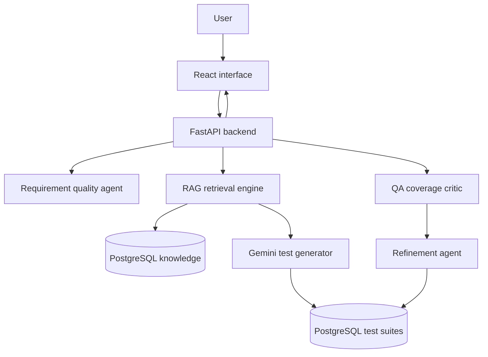
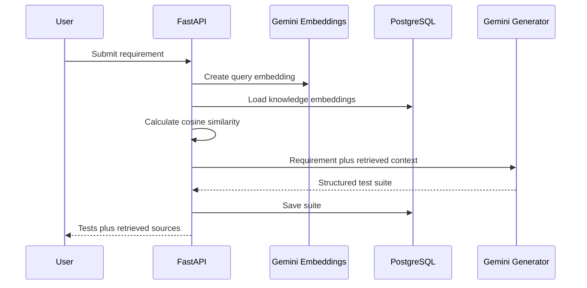

# QA Test Case Generation Agent

An AI-powered quality assurance assistant that converts application requirements and user stories into structured, comprehensive test cases.

This project was developed for **TCS APEX Capstone Project 9: Quality Assurance Test Case Generation Agent**.

## Problem Statement

Writing QA test cases manually is time-consuming and can result in missing important scenarios. This application uses a Large Language Model to interpret requirements and generate structured test cases containing test data, preconditions, actions and expected results.

The application also supports requirement-quality analysis, iterative refinement, coverage review, PostgreSQL persistence, Retrieval-Augmented Generation and critic-guided agentic improvement.

## Core Features

- Requirement and user-story input
- AI requirement-quality analysis
- Clarity score from 0 to 100
- Ambiguity identification
- Clarification-question generation
- Positive, negative and boundary test cases
- Validation and security test cases
- Structured test steps and expected results
- Iterative test-suite refinement
- Duplicate test-case prevention
- AI coverage review and recommendations
- Critic-guided automatic suite improvement
- PostgreSQL persistence
- Retrieval of previously stored test suites
- CSV export with spreadsheet-injection protection
- Dark responsive React interface

## Advanced Features

### Retrieval-Augmented Generation

The application contains a lightweight PostgreSQL-backed RAG pipeline.

1. Trusted QA knowledge is converted into 768-dimensional embeddings.
2. Embeddings and their original text are stored in PostgreSQL.
3. A submitted requirement is converted into a query embedding.
4. Cosine similarity ranks stored knowledge by semantic relevance.
5. The top relevant knowledge chunks are added to the generation context.
6. Gemini generates test cases grounded in the retrieved knowledge.
7. Retrieved source names are returned for traceability.

The demonstration implementation stores vectors as PostgreSQL JSONB and performs cosine similarity in Python. For a much larger production knowledge base, the storage layer can be migrated to `pgvector` with vector indexing.

### Agentic QA Workflow

The frontend implements a controlled critic-guided workflow:

1. Generate an initial test suite.
2. Send the suite to an AI QA critic.
3. Calculate a coverage score.
4. Identify missing, overlapping or unsupported scenarios.
5. Convert critic recommendations into refinement instructions.
6. Generate an improved test suite.
7. Review the improved suite again.

A controlled iteration is used instead of an unlimited loop to prevent excessive API usage and unpredictable behaviour.

## Assignment Compliance

| Assignment requirement | Implementation |
|---|---|
| Use an LLM to interpret requirements | Gemini API with structured response schemas |
| Generate functional test scenarios | Multiple functional and security scenario types |
| Accept requirement descriptions | React requirement workspace |
| Support iterative refinement | Test-suite refinement endpoint and interface |
| Use sample requirements or user stories | Text-based requirement input |
| Produce structured test cases | IDs, titles, priorities, preconditions, data, steps and expected results |

## Technology Stack

### Backend

- Python 3.12
- FastAPI
- Pydantic
- SQLAlchemy
- PostgreSQL
- Google Gemini API
- Gemini Embeddings

### Frontend

- React
- Vite
- JavaScript
- CSS

### Development Tools

- Git and GitHub
- VS Code
- Swagger/OpenAPI
- pgAdmin 4

## System Architecture



## RAG Request Flow



## Database Structure

The application uses four main tables:

- `requirements` stores submitted requirements and quality information.
- `test_cases` stores generated test-case details.
- `test_steps` stores ordered actions and expected results.
- `knowledge_chunks` stores trusted RAG text and embeddings.

Relationships:

- One requirement can contain many test cases.
- One test case can contain many test steps.
- Deleting a requirement cascades to its cases and steps.

## API Endpoints

| Method | Endpoint | Purpose |
|---|---|---|
| GET | `/` | API status |
| GET | `/health/database` | PostgreSQL health check |
| POST | `/requirements/quality-check` | Analyse requirement quality |
| POST | `/requirements/analyze` | Generate a RAG-grounded test suite |
| GET | `/requirements/{id}/test-cases` | Retrieve a stored suite |
| POST | `/test-cases/refine` | Refine existing test cases |
| POST | `/test-cases/review` | Review coverage and quality |
| POST | `/knowledge` | Store trusted RAG knowledge |
| POST | `/knowledge/search` | Perform semantic knowledge search |

Swagger documentation is available at:

```text
http://127.0.0.1:8000/docs
```

## Local Setup

### Prerequisites

Install:

- Python 3.12
- Node.js and npm
- PostgreSQL
- Git

### 1. Clone the repository

```bash
git clone https://github.com/agjal2005-wq/qa-test-case-generation-agent.git
cd qa-test-case-generation-agent
```

### 2. Create the PostgreSQL database

Connect to PostgreSQL and create:

```sql
CREATE DATABASE qa_test_agent;
```

The local development database can run on PostgreSQL port `5433`. If your installation uses the standard port, use `5432`.

### 3. Configure the backend

Enter the backend folder:

```powershell
cd backend
```

Create and activate a virtual environment:

```powershell
py -3.12 -m venv .venv
.\.venv\Scripts\Activate.ps1
```

Install dependencies:

```powershell
python -m pip install -r requirements.txt
```

Create a `.env` file containing the Gemini API key and PostgreSQL connection configuration used by `database.py`.

Never commit the `.env` file.

### 4. Create database tables

```powershell
python create_tables.py
```

### 5. Start FastAPI

```powershell
uvicorn main:app --reload
```

### 6. Seed the RAG knowledge base

Keep FastAPI running and execute this in another activated backend terminal:

```powershell
python seed_knowledge.py
```

The script is idempotent: existing knowledge records are detected and are not inserted again.

### 7. Start the frontend

From the project root:

```powershell
cd frontend
npm install
npm run dev
```

Open:

```text
http://localhost:5173
```

## Example Requirement

```text
The university chatbot should answer admission questions and provide links to relevant official sources.
```

The application can produce tests for:

- successful admission questions;
- ambiguous questions;
- unavailable information;
- invalid or empty input;
- long and Unicode input;
- official-link validation;
- hallucination prevention;
- prompt injection;
- malicious scripts;
- service failure and recovery;
- multi-turn conversation context.

## Structured Output

Each generated test case includes:

```json
{
  "test_case_id": "TC-001",
  "title": "Verify a valid admission question",
  "scenario_type": "Positive",
  "priority": "High",
  "preconditions": [
    "The chatbot service is available"
  ],
  "test_data": [
    "Question: What is the admission deadline?"
  ],
  "steps": [
    {
      "step_number": 1,
      "action": "Submit the admission question.",
      "expected_result": "The chatbot returns a relevant answer with an official source link."
    }
  ]
}
```

## Security and Reliability Considerations

- Requirements and retrieved knowledge are treated as data, not system instructions.
- Prompt-injection scenarios are included in generated security tests.
- Pydantic validates AI-generated JSON against strict schemas.
- Test-case IDs are constrained and sequential.
- Duplicate knowledge records are prevented.
- Database relationships use cascade deletion.
- CSV fields are escaped to reduce spreadsheet-formula injection risk.
- API keys and database credentials remain outside source control.

## Cost-Conscious Design

The project uses a local PostgreSQL database and open-source frontend/backend technologies. Duplicate knowledge detection avoids unnecessary embedding requests. The agentic workflow uses a bounded improvement cycle to control API usage.

## Future Enhancements

- Replace JSONB embedding storage with `pgvector`
- Add indexed vector similarity search
- Upload and automatically chunk PDF requirement documents
- Add authentication and role-based access
- Add automated unit and integration tests
- Containerize using Docker
- Deploy the frontend and backend
- Add test-suite version history
- Export to additional QA-management formats

## Author

**Bedagranee Ghosh**  
M.Tech Computer Science and Engineering
University of Calcutta